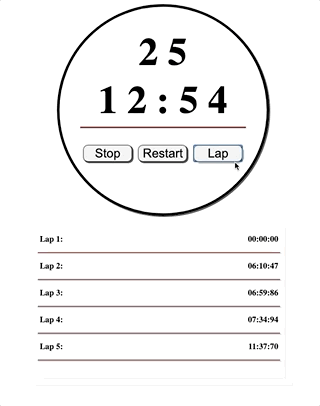
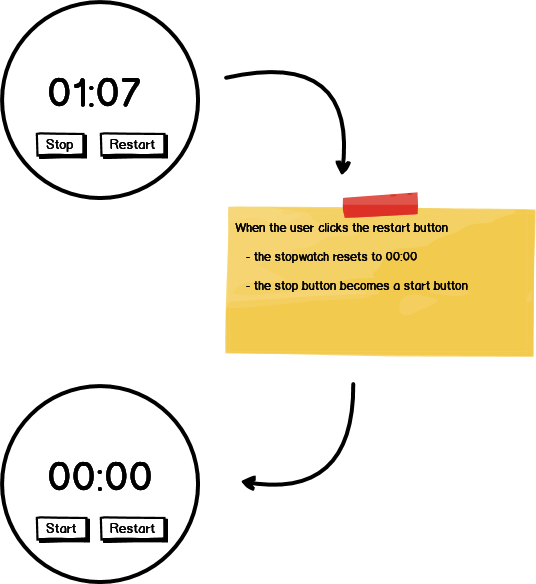
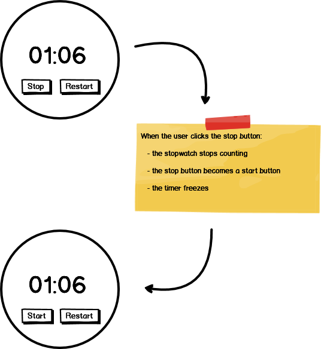
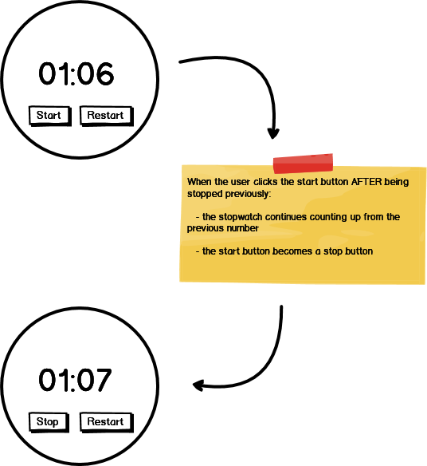

# stopwatch-challenge

Using HTML, CSS, and JavaScript to build a stopwatch application.

### Challenge

Use HTML, CSS, and JavaScript to create a `Stopwatch` application that can be started, paused, and reset.

### Feature List

  - [User can start watch](#user-can-start-watch)
  - [User can restart watch](#user-can-restart-watch)
  - [User can stop watch](#user-can-stop-watch)
  - [User can continue watch](#user-can-continue-watch)

## Mockup

### User can start watch

___
### User can restart watch

___
### User can stop watch

___
### User can continue watch

___

### Stretch Features

- User Can Record lap times
- User Can See milliseconds
